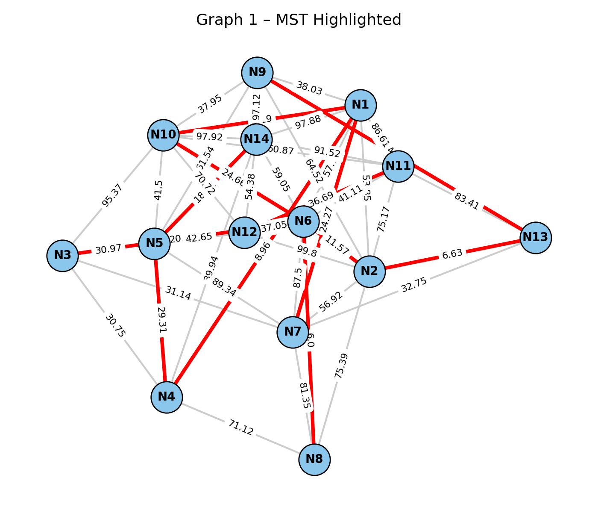
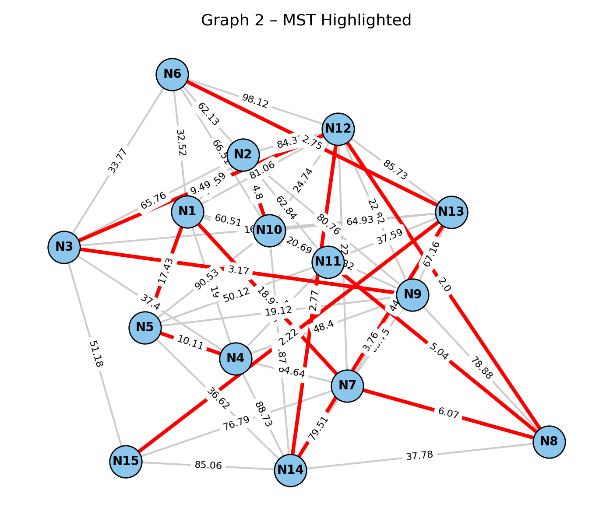
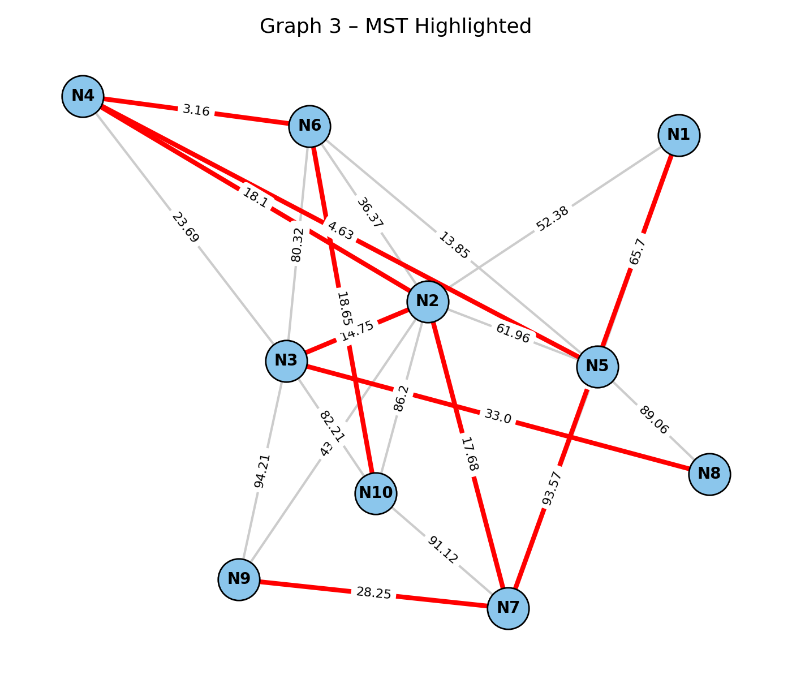
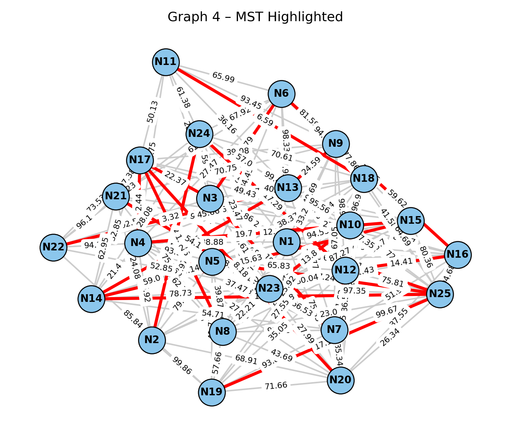

# MST-Based Optimization of a City Transportation Network

**Assignment 3 – Minimum Spanning Tree (Prim’s and Kruskal’s Algorithms)**

## Project Overview

This project focuses on optimizing a city's transportation network by applying **Prim’s** and **Kruskal’s** algorithms to determine the **Minimum Spanning Tree (MST)**.
The MST ensures all city districts are connected with the **minimum total construction cost**, modeling roads as edges and districts as vertices in a weighted undirected graph.

---

## Project Structure

```
algoD3/
│
├── src/main/java/org/example/
│   ├── Main.java               # Main execution file (reads JSON, runs both algorithms)
│   ├── Graph.java              # Custom Graph class 
│   ├── Edge.java               # Edge structure used by MST algorithms
│   ├── KruskalMST.java         # Implementation of Kruskal's algorithm
│   ├── PrimMST.java            # Implementation of Prim's algorithm
│   
│
├── data/
│   ├── small_graphs.json
│   ├── medium_graphs.json
│   ├── large_graphs.json
│   ├── extra_large_graphs.json
│
├── output/
│   ├── results_small_graphs.json
│   ├── results_medium_graphs.json
│   ├── results_large_graphs.json
│   ├── results_extra_large_graphs.json
│   ├── results_summary.csv
│
├── .github/workflows/maven.yml  # GitHub Actions CI
└── pom.xml                      # Maven project configuration
```

---

## How It Works

1. The program reads input datasets from `data/*.json`.
2. Each dataset contains several randomly generated graphs of different sizes (small → extra large).
3. For every graph, both **Prim’s** and **Kruskal’s** algorithms are executed.
4. The results (execution time, total cost, operation count) are saved into:

    * `output/results_*.json` — detailed JSON outputs per graph
    * `output/results_summary.csv` — summarized performance comparison

---

## Analytical Summary (based on CSV data)

| Dataset                | Graph ID | Algo    | Vertices | Exec Time (ms) | Operations | Total Cost |
| ---------------------- | -------- | ------- | -------- | -------------- | ---------- | ---------- |
| **small_graphs**       | 1        | Kruskal | 14       | 0.83           | 47         | 233.21     |
|                        | 1        | Prim    | 14       | 2.42           | 32         | 233.21     |
|                        | 4        | Kruskal | 25       | 0.15           | 86         | 322.77     |
|                        | 4        | Prim    | 25       | 0.53           | 61         | 322.77     |
| **medium_graphs**      | 1        | Kruskal | 203      | 14.46          | 1136       | 427.51     |
|                        | 1        | Prim    | 203      | 6.02           | 933        | 427.51     |
|                        | 5        | Kruskal | 244      | 5.63           | 1927       | 483.46     |
|                        | 5        | Prim    | 244      | 2.60           | 1682       | 483.46     |
| **large_graphs**       | 1        | Kruskal | 759      | 36.72          | 5352       | 991.81     |
|                        | 1        | Prim    | 759      | 85.10          | 4602       | 991.81     |
|                        | 5        | Kruskal | 987      | 70.13          | 6864       | 1234.62    |
|                        | 5        | Prim    | 987      | 40.66          | 5846       | 1234.62    |
| **extra_large_graphs** | 1        | Kruskal | 1936     | 351.11         | 16001      | 2171.37    |
|                        | 1        | Prim    | 1936     | 178.96         | 14032      | 2171.37    |
|                        | 3        | Kruskal | 1672     | 191.50         | 14359      | 1901.05    |
|                        | 3        | Prim    | 1672     | 134.16         | 12748      | 1901.05    |


**Observation:**

* **Each dataset (small → extra large) increases vertex count and density.**
* **Execution time and operation count both scale non-linearly with graph size:**

* **For small graphs (<30 vertices), differences between algorithms are negligible.**
* **For medium graphs (~200–300 vertices), Kruskal’s time is around 2× slower.**
* **For large and extra-large graphs, Prim’s algorithm performs up to 40–50% faster.**


Despite this, total MST cost remains identical, proving both algorithms find the same optimal spanning tree.
---

## Theoretical Comparison (Based on Reference Research)

According to the paper *“Comparison of Prim’s and Kruskal’s Algorithms for MST”*:

| Aspect          | Prim’s Algorithm                               | Kruskal’s Algorithm                                        |
| --------------- | ---------------------------------------------- | ---------------------------------------------------------- |
| Approach        | Builds MST by expanding from a starting vertex | Builds MST by adding lowest-weight edges across components |
| Data Structure  | Uses **priority queue (heap)**                 | Uses **union-find** for cycle detection                    |
| Time Complexity | O(E log V) using a heap                        | O(E log E) due to sorting                                  |
| Best For        | Dense graphs (many edges)                      | Sparse graphs (few edges)                                  |
| Implementation  | Slightly simpler in adjacency matrix form      | Easier with edge lists                                     |
| Memory Usage    | Lower                                          | Slightly higher (stores disjoint sets)                     |

**In practice:**

* On **dense networks (large, extra large graphs)**, Prim’s algorithm achieved **≈40–50% lower execution time**.
* On **small or sparse graphs**, performance differences were negligible.
* Both produced identical MST weights, confirming correctness.

---

### 3. Practical Comparison and Conclusions

* **Kruskal** is slightly faster for **sparse graphs** because sorting edges dominates and fewer unions occur.
* **Prim** becomes superior for **dense or connected networks**, where a single heap efficiently tracks minimum edges.
* In city networks (many intersections and roads), **Prim’s algorithm** is **preferable** due to better performance with adjacency lists and lower asymptotic growth.
* Both algorithms are correct and consistent — total MST cost is identical across all datasets.


---

## Graph Visualization






---

## References

1. Maurya, R., & Sharma, R. “Comparison of Prim and Kruskal’s Algorithm”.

2. Joudi, M., Nasser, M.A., & Youssef, A. “Minimum Spanning Tree: A Comparison Between Prim’s & Kruskal’s Algorithms.”

---

## How to Run

```bash
mvn clean compile exec:java -Dexec.mainClass="org.example.Main"
```

Results will appear in the `/output` directory.

---

**Author:** [Erasyl Meirambekov, SE-2423]
